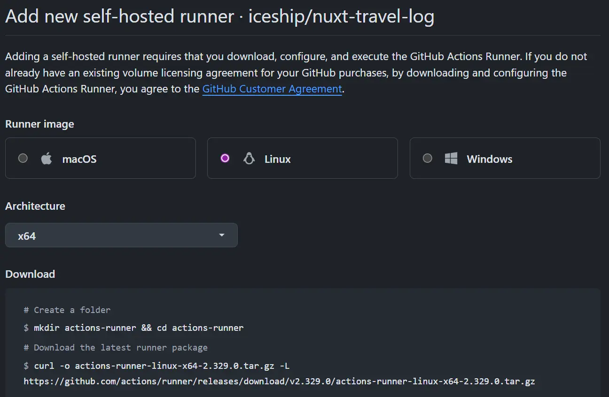

## Mini PC

집에서 아무 일(?) 하지 않는 Mini PC를 이용하는 방법 중에 하나

### 배포
[Nuxt](https://nuxt.com)로 개발을 하면서 주로 [Vercel](https://vercel.com)에 배포를 하였는데,
이번에 집에서 놀고 있는 Mini PC를 사용해서 Vercel처럼 한번에 배포되는 걸 해보자

### 기존 Vercel
아주 쉽게 vercel에서는 github repository랑 연동되어서 Import 한번이면 끝

### 전체 구조
1. Local 개발 후, Github에 push
2. Github Actions에서 Webhook 트리거 되고
3. 내부 Self-hosted Runner가 작업을 시작
4. Build & Deploy

## Self Hosted Runner 시작
Proxmox에 Debian LXC를 만들고, Github에 Actions Runner로 등록

### Create CT
```bash
#!/bin/bash

# --- 설정 변수 (이 부분만 수정해서 사용하세요) ---
NEW_VMID="600"                            # 새로 생성할 컨테이너 ID
STORAGE="local-zfs"                       # config에 있던 스토리지 이름
TEMPLATE="local:vztmpl/debian-12-standard_12.7-1_amd64.tar.zst" # 사용할 OS 템플릿
ROOT_PASS="변경할비밀번호"                  # 새로 설정할 Root 비밀번호

# --- 컨테이너 생성 명령어 ---
pct create $NEW_VMID $TEMPLATE \
  --arch amd64 \
  --hostname runner \
  --cores 4 \
  --memory 4096 \
  --swap 2048 \
  --rootfs ${STORAGE}:8 \
  --net0 name=eth0,bridge=vmbr0,firewall=1,ip=dhcp,ip6=auto,type=veth \
  --features nesting=1 \
  --tags runner \
  --unprivileged 1 \
  --description "github action runner" \
  --password $ROOT_PASS \
  --start 0

echo "LXC Container $NEW_VMID created successfully."
```
Debian Container를 하나 만들어주고

#### LXC 연결하고 runner 사용자 생성
```bash
pct enter <CT_ID>

apt update && apt upgrade -y
apt install -y curl git tar sudo

useradd -m -s /bin/bash runner
passwd runner  # 원하면 비번 설정
usermod -aG sudo runner

su - runner
```

### Github에서 Self-hosted Runner용 설정 값 얻기
1. 연결하고 싶은 레포에서 
2. `Settings` → 왼쪽 메뉴의 **Actions** → **Runners** →  **“New self-hosted runner”** 버튼 클릭 
   [자세한 설명은 여기](https://docs.github.com/ko/actions/concepts/runners/self-hosted-runners)

#### Install Guide 

이런 식의 가이드가 나오면 위에서 생성한 LXC에 root 계정이 아닌 생성한 계정으로 로그인하고붙여넣기로 설치

우리는 우선 하나의 레포에서만 사용하기 때문에 질문은 기본 값으로 넘기기

#### 서비스로 등록
계속 작동해야 되니 서비스로 등록해보자
```
sudo ./svc.sh install
sudo ./svc.sh start
sudo ./svc.sh status
```

#### Github에서 Runners 확인
`Settings` → 왼쪽 메뉴의 **Actions** → **Runners**에서 Stats 녹색 Idle이 나오면 등록 성공

### nvm 설치 
actions runner가 환경을 분리해서 굳이 설치 안 해줘도 될 것 같은데,
그래도 혹시 모르니 nvm, node 24, pnpm 설치
```bash
curl -o- https://raw.githubusercontent.com/nvm-sh/nvm/v0.40.3/install.sh | bash
source ~/.bashrc
nvm install 24
nvm alias default 24
node -v
npm install -g corepack
corepack enable pnpm
corepack use pnpm@latest-10
pnpm -v
```


### 이제 Nuxt 프로젝트 설정
deploy 설정
```yml
// .github/workflows/deploy.yml

name: Deploy to Proxmox LXC Runner
on:
  push:
    branches:
      - main
jobs:
  deploy:
    runs-on: self-hosted

    steps:
      - name: Checkout
        uses: actions/checkout@v4

      - name: Setup pnpm
        uses: pnpm/action-setup@v4
        with:
          version: 10

      - name: Setup Node.js 24
        uses: actions/setup-node@v4
        with:
          node-version: "24"
          cache: "pnpm"

      - name: Install Dependencies
        run: pnpm install --frozen-lockfile

      - name: Build
        run: pnpm run build

      - name: Install PM2 locally for Action
        run: npm install -g pm2

      - name: Start/Reload PM2
        run: |
          pm2 describe nuxt-travel-app > /dev/null || true

          if pm2 list | grep -q "nuxt-travel-app"; then
            echo "App is running. Reloading..."
            pm2 reload ecosystem.config.cjs
          else
            echo "App is not running. Starting..."
            pm2 start ecosystem.config.cjs
          fi

          pm2 save

```

#### pm2 사용을 위한 ecosystem.config.cjs 생성
pm2를 사용하는 방법 [nuxt deployment pm2](https://nuxt.com/docs/4.x/getting-started/deployment#pm2)
```cjs
// ecosystem.config.cjs
module.exports = {
  apps: [
    {
      name: 'NuxtAppName',
      port: '3000',
      exec_mode: 'cluster',
      instances: 'max',
      script: './.output/server/index.mjs',
    },
  ],
}
```

#### nuxt config에 node-server 설정(옵션?)
node 서버이기 때문에 추가해야 된다고 설명해주는데, 아직 왜 정확하게 사용해야 되는지 이해를 못 함, 하지만 추가 함
```typescript
// nuxt.config.ts
export default defineNuxtConfig({
  nitro: {
    preset: 'node-server',
  },
})
```

## 끝
이제 github에 push하면 lxc runner 서버에 연결해서 빌드하고 배포하는 아름다운 모습을 볼 수 있음 

끝.... 은 아니고
외부에서 연결할 수 있도록 cloudflare zero trust를 사용해서 설정해줘야 되는데,
이건 다른 글로 설명하겠습니다.

진짜 끝
